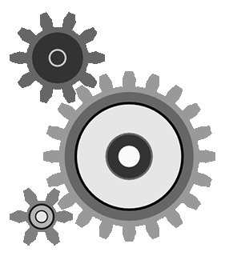

<h1> Hey! I´m Andrés ✦✮💫 </h1>
 

##  About me 
<picture> </picture>
🎓 Student of **Administración de Sistemas Informáticos en Red (ASIR)** at CIFP Carlos III, building a strong and practical foundation in IT infrastructures. 
💻 Deeply passionate about computer science, electronics, and the fascinating world of cybersecurity; always curious to understand how technology works under the hood. 
⚙️ Highly interested in operating systems administration (Linux & Windows), network architecture deployment, and hardware troubleshooting. 
🛡️ Focused on learning the core principles of network security, system hardening, and data protection to defend against modern digital threats. 
🧠 Proactive and self-driven, always seeking to tackle new technical challenges, automate processes, and stay updated with the latest tech industry trends. 
🚀 Actively in the process of learning, expanding my technical knowledge, and sharpening my hands-on skills to become a versatile, reliable, and highly qualified professional in the IT sector. 

---
##  ⌞ Currently learning ⌝
- Fundamentals of **Linux** and **Windows**
- - Networking and basic **cybersecurity** concepts  
- Virtualization with **VirtualBox** / **VMware**
- **Markdown** principles
- Structuring with **markup languages**
- **Database** and information management

##  ⌞ Tools & Tecnologys ⌝
- **Operating Systems:** Linux (Ubuntu, Debian, Arch), Windows  
- **Virtualization:** VirtualBox and VMware
- **Databases:** SQLite and MariaDB
- **Network Simulation:** Cisco Packet Tracer 5.3.3 
- **Version Control:** Git & GitHub  
- **Suites:** Office, LibreOffice, Google Docs
- **Note Management:** Notion and Obsidian

---
##  ⌞ My Objetives ⌝
- Improve my knowledge in Linux and Windows systems administration  
- Learn about **Python** programming and **Web front-end**
- Get introduced to **cybersecurity** and **Bash scripting**
- Apply automation with **scripts** and **AI** to personal tasks 
- Continue my **training** in the tech sector

##  ⌞ Projects On Going ⌝
- Class documentation/notes in **Markdown**
- **Practical** assignments and tasks related to ASIR modules
- Individual **code** proyects
- Learning plataforms like **Hack the Box**, **DockerLabs**, **TryHackMe**
- **Raspberry Pi** proyects

---
### 💻 Stacks ❀˖°
      
### 📊 Stats ⟢ .ᐟ

  
   
  

### 🏆 Vitrina ₊ ⊹

---

> 

---

  
    🚧 En construcción 🚧
  

  

### 🌐 RRSS
    

  

  

## 🐍 Contributions

  <picture>
    <source media="(prefers-color-scheme: dark)" srcset="https://raw.githubusercontent.com/7oSkaaa/7oSkaaa/output/github-contribution-grid-snake-dark.svg">
    <source media="(prefers-color-scheme: light)" srcset="https://raw.githubusercontent.com/7oSkaaa/7oSkaaa/output/github-contribution-grid-snake.svg">
    
  </picture>

 

  

###
